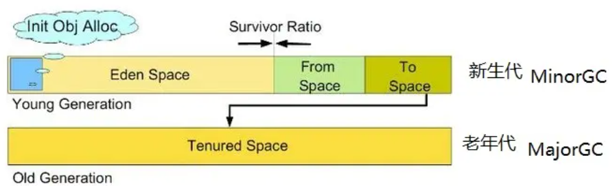
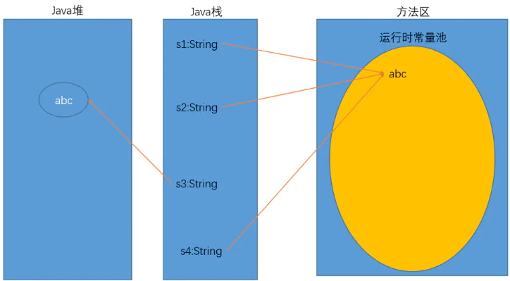

# JVM 内存模型
<!-- TOC -->

- [JVM 内存模型](#jvm-%E5%86%85%E5%AD%98%E6%A8%A1%E5%9E%8B)
    - [程序计数器 (线程私有)](#%E7%A8%8B%E5%BA%8F%E8%AE%A1%E6%95%B0%E5%99%A8-%E7%BA%BF%E7%A8%8B%E7%A7%81%E6%9C%89)
    - [Java虚拟机栈 (线程私有)](#java%E8%99%9A%E6%8B%9F%E6%9C%BA%E6%A0%88-%E7%BA%BF%E7%A8%8B%E7%A7%81%E6%9C%89)
        - [局部变量](#%E5%B1%80%E9%83%A8%E5%8F%98%E9%87%8F)
        - [操作数栈](#%E6%93%8D%E4%BD%9C%E6%95%B0%E6%A0%88)
        - [动态链接](#%E5%8A%A8%E6%80%81%E9%93%BE%E6%8E%A5)
        - [方法返回地址](#%E6%96%B9%E6%B3%95%E8%BF%94%E5%9B%9E%E5%9C%B0%E5%9D%80)
    - [本地方法栈 (线程私有)](#%E6%9C%AC%E5%9C%B0%E6%96%B9%E6%B3%95%E6%A0%88-%E7%BA%BF%E7%A8%8B%E7%A7%81%E6%9C%89)
    - [堆](#%E5%A0%86)
    - [方法区](#%E6%96%B9%E6%B3%95%E5%8C%BA)
        - [运行时常量池](#%E8%BF%90%E8%A1%8C%E6%97%B6%E5%B8%B8%E9%87%8F%E6%B1%A0)
            - [Samples：](#samples)
                - [sample-1](#sample-1)
                - [sample-2](#sample-2)
    - [直接内存](#%E7%9B%B4%E6%8E%A5%E5%86%85%E5%AD%98)
        - [OutOfMemory (OOM) | StackOverflowError (SO) 来源](#outofmemory-oom--stackoverflowerror-so-%E6%9D%A5%E6%BA%90)

<!-- /TOC -->
## 程序计数器 (线程私有)
当前线程所执行字节码的行号指示器。线程切换后，恢复线程到正确的执行位置。
## Java虚拟机栈 (线程私有)
生命周期与线程一样，创建一个线程的时候，就会创建相应的线程栈。
### 局部变量
存储线程执行方法的局部方法
### 操作数栈
tbd
### 动态链接
### 方法返回地址
记录方法返回的地址

## 本地方法栈 (线程私有)
执行native方法时候，压入方法栈，包括入参，局部变量

## 堆
所有实列对象存放的地方。所谓的垃圾回收主要是集中与此内存模型之中。根据回收内存的便利性，细分为多种类：
* 新生代
    * from space
    * to space
* 老年代


## 方法区
* 存储被JVM记载的类信息，常量，静态变量，编译之后的代码
* 不同的JVM虚拟机实现，通过不同方法来实现方法区。
    * hotspot在JDK 1.7中使用了永久代(Permanent Generation)来实现
    * hotspot在JDK 1.8中使用了metaspace来实现

### 运行时常量池
__方法区的一部分__, 为了避免频繁的创建和销毁对象而影响系统性能，其实现了对象的共享。
  * 节省内存空间：常量池中所有相同的字符串常量被合并，只占用一个空间。
  * 节省运行时间：比较字符串时，==比equals()快。对于两个引用变量，只用==判断引用是否相等，也就可以判断实际值是否相等。       

存储过程：
* 在类加载之后，存储编译期生成的各种字面量和符号引用。
* 在运行期间，也可以把常量放入。string intern()方法。

#### Samples：
##### sample-1
```
String s1 = new String("xyz"); //创建了几个对象？
```
考虑类加载阶段和实际执行时。
* 类加载对一个类只会进行一次。"xyz"在类加载时就已经创建并驻留了（如果该类被加载之前已经有"xyz"字符串被驻留过则不需要重复创建用于驻留的"xyz"实例）。驻留的字符串是放在全局共享的字符串常量池中的。
* 在这段代码后续被运行的时候，"xyz"字面量对应的String实例已经固定了，不会再被重复创建。所以这段代码将常量池中的对象复制一份放到heap中，并且把heap中的这个对象的引用交给s1 持有。

##### sample-2
    // 1.编译期生成的各种字面量、符号引用      
    ```  
    String s1 = "abc";
    String s2 = "abc";    

    String s3 = new String("abc");    
    ```
    // true:因为"abc"第一次出现将被放在运行时常量池中，后面再有相关变量需要使用，就直接指向它    
    ```
    System.out.println(s1 == s2);
    
    //false:new会直接在java堆空间中创建对象       
    System.out.println(s1 == s3);
    ```
  
    // 2.运行期间新的常量  
    // true:intern方法会把堆中字符串转移到运行时常量池中，并返回常量池中的引用      
    ```
    String s4 = s3.intern();
    System.out.println(s1 == s4);
    ```



## 直接内存
不是JVM运行时的数据区的一部分。主要是计算机内部的内存。而JAVA通过CHANNEL和buffer等I/O方式(DirectByteBuffer)，对其进行使用.


### OutOfMemory (OOM) | StackOverflowError (SO) 来源
* Java虚拟机栈, 
    * 如果线程的请求栈太深，如递归，就会报SO
    * 如果创建太多线程，导致虚拟机栈创建时候无法申请到足够内存，就报OOM
* 本地方法栈
    * 与java虚拟机栈同理，都会报SO && OOM。 hotspot是把本地方法栈和java虚拟机栈合二为一。
* Java堆
    * 创建对象，分配不到足够的内存时候，报OOM
* 方法区
    * 运行时常量池，如果申请不到也会报OOM。比如，在运行时间，无限的string intern()。 就会报 OOM
    * 申请内存不足时候报OOM
* 直接内存
    * 多I/O，使用内存大于物理内存 __限制__ 的时候,报OOM

