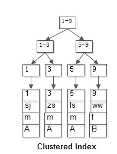
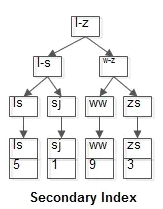

# 索引 Index
<!-- TOC -->

- [索引 Index](#%E7%B4%A2%E5%BC%95-index)
    - [主键索引 Primary Key  = 聚集索引 Clustered  Index](#%E4%B8%BB%E9%94%AE%E7%B4%A2%E5%BC%95-primary-key---%E8%81%9A%E9%9B%86%E7%B4%A2%E5%BC%95-clustered--index)
        - [聚集索引如何加速查询](#%E8%81%9A%E9%9B%86%E7%B4%A2%E5%BC%95%E5%A6%82%E4%BD%95%E5%8A%A0%E9%80%9F%E6%9F%A5%E8%AF%A2)
    - [二级索引   Secondary Index](#%E4%BA%8C%E7%BA%A7%E7%B4%A2%E5%BC%95---secondary-index)
    - [哈希索引  Hash  Index](#%E5%93%88%E5%B8%8C%E7%B4%A2%E5%BC%95--hash--index)
    - [索引 优化 Optimization and Indexes](#%E7%B4%A2%E5%BC%95-%E4%BC%98%E5%8C%96-optimization-and-indexes)
        - [索引覆盖 covering index](#%E7%B4%A2%E5%BC%95%E8%A6%86%E7%9B%96-covering-index)
        - [主键优化](#%E4%B8%BB%E9%94%AE%E4%BC%98%E5%8C%96)
        - [SPATIAL Index Optimization ?](#spatial-index-optimization-)
        - [外键优化](#%E5%A4%96%E9%94%AE%E4%BC%98%E5%8C%96)
        - [Column Indexes](#column-indexes)
            - [Index Prefixes](#index-prefixes)
            - [FULLTEXT Indexes](#fulltext-indexes)
                - [FULLTEXT search function](#fulltext-search-function)

<!-- /TOC -->
__本文多指在MySQL InnoDB的引擎下__

## 主键索引 Primary Key  = 聚集索引 Clustered  Index
顾名思义，就是为主键创建的索引。这里需要注意的是，Innodb给创建该索引的时候。    
__Note__: 聚集索引也是主键索引在innodb的别称. [reference](https://dev.mysql.com/doc/refman/8.0/en/glossary.html#glos_clustered_index)
每个InnoDB表都有一个称为聚集索引的特殊索引，其中存储了行的数据。InnoDB聚集索引的叶子节点存储行记录，因此， InnoDB必须要有，且只有一个聚集索引：
* 如果表定义了PK，则PK就是聚集索引；
* 如果表没有定义PK，则第一个not NULL unique列是聚集索引；
* 如果表没有主键或合适的唯一索引，InnoDB会自己创建一个隐藏的聚集索引(GEN_CLUST_INDEX),包含一个row ID的值。这些行会根据InnoDB插入的时候赋予一个值(6-byte，自增)。换句话来说，按照row ID进行排序其实也就是按照行的插入顺序排序。

### 聚集索引如何加速查询
在InnoDB引擎上，聚集索引的根节点是会存储所有的行数据。这样的话，直接能够快速定位查找到相应的数据。   



__Note__: InnoDB在索引B树的子节点上面，存储的是表行数据。而，MyISAM则是硬盘地址。

## 二级索引   Secondary Index
MySQL中为表中一列或者多列创建的索引为二级索引。主要目的是为了加速特定的查询语句，
在创建和删除二级索引的时候，会涉及到大量的表中数据的拷贝与复制。在Mysql中，可以使用Fast Index Creation功能，进快速创建。   



## 哈希索引  Hash  Index
___Exceptions: Indexes on spatial data types use R-trees; MEMORY tables also support hash indexes; InnoDB uses inverted lists for FULLTEXT indexes.___

## 索引 优化 Optimization and Indexes

### 索引覆盖 covering index
如果一个查询返回的值能在二级索引的列中，那么，这个查询就不需要进行回表查询，这样的话，查询速度就快。

### [主键优化](https://dev.mysql.com/doc/refman/8.0/en/primary-key-optimization.html)
* 主键快速查询完全得利于该列Not Null的属性。
* 如果表非常大或者重要，并且没有明显的列作为主键，那么建议创建一列自增值的列来作为主键，这样能够在加速表查询和join的时候作为外键。

### SPATIAL Index Optimization ?

### [外键优化](https://dev.mysql.com/doc/refman/8.0/en/foreign-key-optimization.html)
* 如果一个表有很多列，并且需要查询很多列的不同组合，可以将不太使用的列分到不同的表中，然后通过数字类型(numeric ID column)的列进行关联。这样的话，这些拆分出去的小表能够使用主键快速查询， 并且也可以使用join操作查询需要的一些消息。(To maximize performance, queries try to read as few data blocks as possible from disk; tables with only a few columns can fit more rows in each data block.)

### Column Indexes
#### Index Prefixes
只为这一列的前N个characters创建索引，这样，就使得索引文件变得较小，从而查询数据就快。如果给BLOB 和 TEXT列创建索引的时候，必须使用prefix方式.
__Note__ prefix索引的数字 
* n个char ==> CHAR VARCHAR TEXT
* n个bytes ==> BINARY, VARBINARY, BLOB
```
CREATE TABLE test (blob_col BLOB, INDEX(blob_col(10)));
```

#### FULLTEXT Indexes
用于全文搜索。适用于CHAR, VARCHAR, TEXT列。
在用explain进行分析的时候，优化器不仅仅会分析整个表达式，而且也会查看执行计划。
##### FULLTEXT search function
在创建FULLTEXT Index的时候，如果数据大，那么可以先加载到表中，然后创建index，这样速度会相应较快。
[reference](https://dev.mysql.com/doc/refman/8.0/en/fulltext-search.html)
